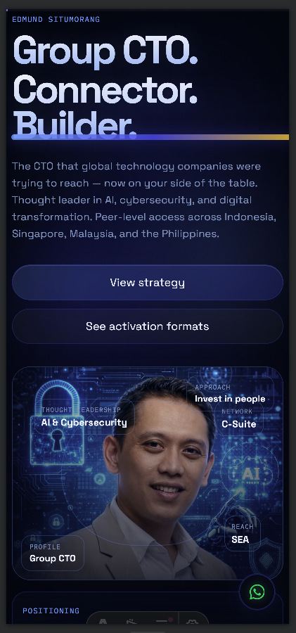

# networth — Edmund Situmorang

> **The CTO that global technology companies were trying to reach — now on your side of the table.**

A high-performance personal profile site built for executive-level market access in Indonesia and Southeast Asia. Designed to communicate technical authority, C-suite network depth, and thought leadership in AI, cybersecurity, and digital transformation — in the aesthetic language of the world's top AI companies.

---

## Preview

<div align="center">
  
</div>

**Live:** [net.edmund.link](https://net.edmund.link)

---

## What this site communicates

| Signal | Detail |
|---|---|
| **Identity** | Group CTO · Connector · Builder |
| **Network** | C-suite peer relationships inside Sinarmas, MNC Group, BCA Group, Jarum Group |
| **Reach** | Indonesia · Singapore · Malaysia · Philippines |
| **Thought leadership** | AI, cybersecurity, and digital transformation |
| **Recognition** | 10+ international awards including CIO 100, Chief AI of the Year 2025 |
| **Languages** | English · Bahasa Indonesia · Tagalog · Mandarin |

---

## Tech stack

| Layer | Technology |
|---|---|
| Framework | [Astro](https://astro.build) v6 — static output, zero JS by default |
| Styling | Vanilla CSS — custom design system, no framework |
| Fonts | IBM Plex Mono + Space Grotesk (Google Fonts) |
| Images | WebP + PNG fallback, Sharp for compression |
| Hosting | Coolify (self-hosted) |
| DNS / CDN | Cloudflare |

---

## Features

- **Midnight + Electric Blue + Gold** palette — enterprise authority aesthetic
- **Text scramble** — section headings decode from random characters on scroll
- **Typewriter** — hero lede types itself on load
- **3D card tilt** — cards tilt toward cursor on hover (desktop only)
- **Counter animation** — market stats count up on scroll
- **Glitch effect** — hero title periodically flickers
- **Scan line** — periodic light beam sweeps the page
- **Floating WhatsApp button** — direct connect, always visible
- **Mobile optimised** — backdrop-filter, heavy animations, and GPU layers disabled on mobile
- **WebP images** — 94% smaller than original (2.5MB → 147KB)
- `prefers-reduced-motion` respected

---

## Local development

```bash
npm install
npm run dev
```

Open [http://localhost:4321](http://localhost:4321)

---

## Build & deploy

### For net.edmund.link
```bash
npm run build:net
# SITE_URL=https://net.edmund.link  SITE_BASE_PATH=/
```

### For edmund.link/accelerasia (legacy)
```bash
npm run build:accelerasia
# SITE_URL=https://edmund.link  SITE_BASE_PATH=/accelerasia
```

Published directory: `dist/`

See [DEPLOY.md](./DEPLOY.md) for full Coolify + Cloudflare DNS setup.

---

## Project structure

```
/
├── public/
│   ├── edmund-tech-portrait.webp   # Primary image (147KB, WebP)
│   ├── edmund-tech-portrait-opt.png # Fallback image (550KB)
│   └── edmund-profile.png
├── src/
│   ├── layouts/
│   │   └── BaseLayout.astro
│   ├── pages/
│   │   └── index.astro             # Single page — all content here
│   └── styles/
│       └── global.css              # Full design system
├── docs/
│   └── screenshot-mobile.png       # Preview screenshot
├── DEPLOY.md
└── package.json
```

---

## Contact

**Edmund Situmorang**
Group Chief Technology Officer · MD CORP

[WhatsApp](https://wa.me/6282122887770) · [LinkedIn](https://www.linkedin.com/in/situmorang/)
